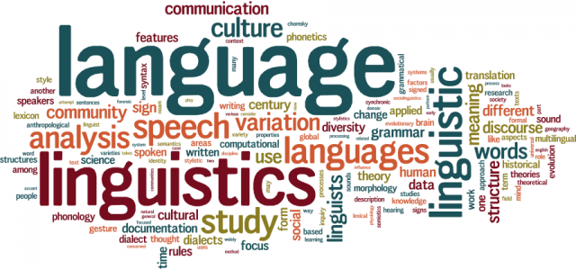

## Natural Language Processing

> Natural-language processing (NLP) is an area of computer science and artificial intelligence concerned with the interactions between computers and human (natural) languages, in particular how to program computers to fruitfully process large amounts of natural language data. Challenges in natural-language processing frequently involve speech recognition, natural-language understanding, and natural-language generation.

   

   

 

  <a href="#d"> Notebooks and descriptions </a> •
  <a href="#ci"> Contact Information </a>  •
  <a href="#nd"> Notebooks and descriptions </a> •
  <a href="#ci"> Contact Information </a> 

   

## Notebooks and descriptions

| Notebook | Brief Description |
|--------------------------------------------------------------------------------------------------------------|-------------------------------------------------------------------------------------------------------------------------------------------------------------------|
| [neural-language-model-and-spinoza](http://nbviewer.jupyter.org/github/marcotav/natural-language-processing/blob/master/neural-language-model-and-spinoza/notebooks/language-model-spinoza-new.ipynb) | Spinoza's Ethics is used to build a language model for text generation with recurrent neural nets.|
| [sentiment-analysis](http://nbviewer.jupyter.org/github/marcotav/natural-language-processing/blob/master/sentiment-analysis/notebooks/sentiment-analysis.ipynb) | A  "reverse sentiment analysis" using Bernoulli Naive Bayes was performed on movie reviews (already classified) to identify which words appear more frequently on reviews from each class. |
| [topic-identification](http://nbviewer.jupyter.org/github/marcotav/natural-language-processing/blob/master/topic-identification-and-entity-recognition/topic-identification/notebooks/topic-identification.ipynb) | Tutorial about topic identification (in progress) |
| [alphabet-human-thought/meaning-of-sentences](http://nbviewer.jupyter.org/github/marcotav/natural-language-processing/blob/master/alphabet-human-thought/meaning-NLU-logic/notebooks/meaning-of-sentences.ipynb) | In this notebook, it will be shown that using logic formalisms one can find more generic translation mechanisms (in progress)  |
| [alphabet-human-thought/sentence-structure](http://nbviewer.jupyter.org/github/marcotav/natural-language-processing/blob/master/alphabet-human-thought/sentence-structure/notebooks/sentence-structure.ipynb) | We will show how to develop formal models for patterns in sequence of words using grammars and parsers (in progress)|

## Contact Information

Feel free to contact me:

* Email: [marcotav65@gmail.com](mailto:marcotav65@gmail.com)
* GitHub: [marcotav](https://github.com/marcotav)
* LinkedIn: [marco-tavora](https://www.linkedin.com/in/marco-tavora)
* Website: [marcotavora.me](http://www.marcotavora.me)

