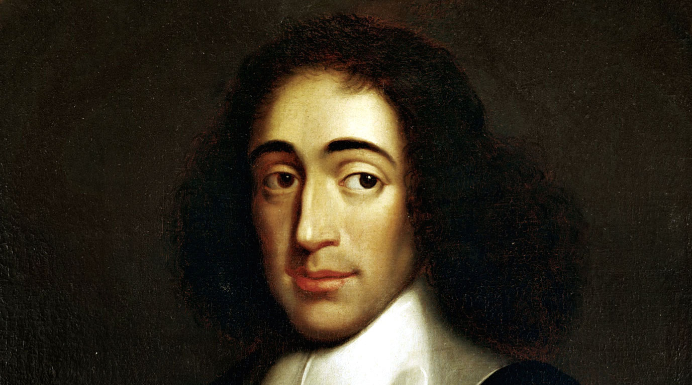

# Neural Language Model and Spinoza's *Ethics*

        
                   
                   

  

        
                         

  <a href="#intro">Introduction </a> •
  <a href="#ethics"> The Ethics </a> •
  <a href="#load"> Loading the text </a>  •
  <a href="#pp"> Preprocessing </a> 

In this project I will show how to build a language model for text generation using deep learning techniques. For more details on this topic and several others [Ref.1](https://machinelearningmastery.com/). 

## Introduction

Though natural language, in principle, have formal structures and grammar, in practice it is full of ambiguities. Modeling it using examples and modeling is an interesting alternative.  The definition of a (statistical) language model given by [Ref.2](https://en.wikipedia.org/wiki/Language_model) is:

> A statistical language model is a probability distribution over sequences of words. Given such a sequence it assigns a probability to the whole sequence.

Or equivalently, given a sequence of words of length m, the model assigns a probability 

  

 

to the whole sequence. In particular, a neural language model can predict the probability of the next word in a sentence (see [Ref.3](https://machinelearningmastery.com/develop-character-based-neural-language-model-keras/) for more details). 

The use of neural networks has become one of the main approaches to language modeling. Three properties can describe this neural language modeling (NLM) approach succinctly [Ref. 3](http://www.jmlr.org/papers/v3/bengio03a.html): 

> We first associate words in the vocabulary with a distributed word feature vector, then express the joint probability function of word sequences in terms of the feature vectors of these words in the sequence and then learn simultaneously the word feature vector and the parameters of the probability function. 

In this project I used Spinoza's Ethics (*Ethica, ordine geometrico demonstrata*) to build a NLM.

## *The Ethics*

From [Ref.4](https://en.wikipedia.org/wiki/Ethics_(Spinoza)):

> Ethics, Demonstrated in Geometrical Order, usually known as the Ethics, is a philosophical treatise written by Benedict de Spinoza. 

The article goes on to say that:

> The book is perhaps the most ambitious attempt to apply the method of Euclid in philosophy. Spinoza puts forward a small number of definitions and axioms from which he attempts to derive hundreds of propositions and corollaries [...]

The book has structure shown below. We see that it is set out in geometrical form paralleling the "canonical example of a rigorous structure of argument producing unquestionable results: the example being the geometry of Euclid" (see [link](https://timlshort.com/2010/06/21/spinozas-style-of-argument-in-ethics-i/)).

> # PART I. CONCERNING GOD. 
> DEFINITIONS.
I. By that which is self—caused, I mean that of which the essence involves existence, or that of which the nature is only conceivable as existent.

> II. A thing is called finite after its kind, when it can be limited by another thing of the same nature; for instance, a body is called finite because we always conceive another greater body. So, also, a thought is limited by another thought, but a body is not limited by thought, nor a thought by body.

> III. By substance, I mean that which is in itself, and is conceived through itself: in other words, that of which a conception can be formed independently of any other conception.

> IV. By attribute, I mean that which the intellect perceives as constituting the essence of substance.”

### Imports

from numpy import array
from pickle import dump
from keras.utils import to_categorical
from keras.utils.vis_utils import plot_model
from keras.models import Sequential
from keras.layers import Dense
from keras.layers import LSTM

from IPython.core.interactiveshell import InteractiveShell
InteractiveShell.ast_node_interactivity = "all" 

### We first write a function to load texts

The steps of the function below are:
- Opens the file 'ethics.txt'
- Reads it into a string
- Closes it

file = "ethics.txt"

def load_txt(file):
    f = open(file, 'r')
    text = f.read()
    f.close()
    return text

### Priting out part of the string

We see it contains lots of new line characters.

load_txt(file)[0:100]

### Loading and splitting the string

raw = load_txt('ethics.txt')

raw[0:100]

## Preprocessing

The first step is tokenization. With the tokens we will be able to train our model. Some other actions are:
- Exclude stopwords (common words, adding no meaning such as for example, "I", "am")
- Take out punctuation and spaces
- Convert text to lower case
- Split words (on white spaces)
- Elimitate `--`,`"`, numbers and brackets
- Dropping non-alphabetic words
- Stemming

import nltk
# nltk.download('stopwords')
  
from nltk.corpus import stopwords
from nltk.stem import PorterStemmer
import string

def cleaner(text):
    stemmer = PorterStemmer()
    stop = stopwords.words('english') 
    text = text.replace('[',' ').replace(']',' ').replace('--', ' ')
    tokens = text.split()
    text = str.maketrans('', '', string.punctuation)
    tokens = [w.translate(text) for w in tokens]
    tokens = [word for word in tokens if word.isalpha()]
    tokens = [word.lower() for word in tokens]
    return tokens

print(cleaner(raw)[0:100])

tokens = cleaner(raw)
#raw.split()
print(tokens[0:10])

### Joining tokens to build `raw` after cleaning

raw = ' '.join(tokens)
raw[0:56]

### Building sequences

n = 20
sequences = list()
for i in range(n, len(raw)):
    sequences.append(raw[i-n:i+1])

### Checking size

There are around 180,000 sequences to be used for training.

len(sequences)

print('first sequence is:',sequences[0])
print('second sequence is:',sequences[1])
print('third sequence is:',sequences[2])

### Saving our prepared sequences

def save_txt(sequences, file):
    f = open(file, 'w')
    f.write('\n'.join(sequences))
    f.close()

out = 'ethics_sequences.txt';
save_txt(sequences, out)

## Training the model

### Loading the sequences and checking for mistakes

raw = load_txt('ethics_sequences.txt')
seqs = raw.split('\n')
print('first sequence is:',seqs[0])
print('second sequence is:',seqs[1])
print('third sequence is:',seqs[2])
seqs[0:10]

### Encoding

We must now encode the sequences as a chain of integers. The list `unique_chars` is made of unique characters:

unique_chars = sorted(list(set(raw)))
unique_chars[0:10]

char_int_map = dict((a, b) for b, a in enumerate(unique_chars))
print('The values corresponding to keys:\n')
print(unique_chars)
print('are:\n')
print(char_int_map)

### Process sequences using the dictionary

encoded_sequences = list()
for seq in seqs:
    encoded_sequences.append([char_int_map[char] for char in seq])

### Printing out sequences and their encoded form

print(sequences[0])
print(encoded_sequences[0])
print(sequences[1])
print(encoded_sequences[1])

### Building an array from the encoded sequences

encoded_sequences = array(encoded_sequences)

encoded_sequences

X,y = encoded_sequences[:,:-1], encoded_sequences[:,-1]

### Hot encoding

sequences = [to_categorical(x, num_classes=len(char_int_map)) for x in X]

sequences[0]

### Features and targets

X = array(sequences)
y = to_categorical(y, num_classes=len(char_int_map))

### Model

size = len(char_int_map)

def define_model(X):
    model = Sequential()
    model.add(LSTM(75, input_shape=(X.shape[1], X.shape[2])))
    model.add(Dense(size, activation='softmax'))
    model.compile(loss='categorical_crossentropy', optimizer='adam', metrics=['accuracy'])
    model.summary()
    return model

model = define_model(X)

### Fitting and saving model and dictionary

history = model.fit(X, y, epochs=30, verbose=2)

loss = history.history['loss']

import matplotlib.pyplot as plt
import numpy as np
%matplotlib inline

fig = plt.figure()
plt.plot(loss)
plt.title('Model Loss')
plt.xlabel('Epoch')
plt.ylabel('Loss')
#pylab.xlim([0,60])
fig.savefig('loss.png')
plt.show();

model.save('model.h5')

dump(char_int_map, open('char_int_map.pkl', 'wb'))

type(model)

## Generating sequences

from pickle import load
from numpy import array
from keras.models import load_model
from keras.utils import to_categorical
from keras.preprocessing.sequence import pad_sequences

def gen_seq(model, char_int_map, n_seq, test_seq, size_gen):
    num_classes=len(char_int_map)
    txt = test_seq
    print(txt)
    # generate a fixed number of characters
    for i in range(size_gen):
        encoded = pad_sequences([[char_int_map[c] for c in txt]], 
                                maxlen=n_seq, truncating='pre')
        encoded = to_categorical(encoded, num_classes=num_classes)
        ypred = model.predict_classes(encoded)
        int_to_char = ''
        for c, idx in char_int_map.items():
            if idx == ypred:
                int_to_char = c
                break
        # append to input
        txt += int_to_char
    return txt

### Loading the model and the dictionary

# load the model
model = load_model('model.h5')
# load the mapping
char_int_map = load(open('char_int_map.pkl', 'rb'))

# test start of rhyme
print(gen_seq(model, char_int_map, 20, 'that which is self caused', 40))
print(gen_seq(model, char_int_map, 20, 'nature for instance a body', 40))

raw[0:400]

### Correct

    1) "that which is self caused i mean that of which the essence"
    2) "nature for instance a body is called finite because we always conceive"

### Conclusion

The model has to learn better probably by increasing the number of epochs.
