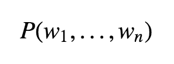

# Neural Language Model and Spinoza's *Ethics*

           
                   
                   
<p align="center">
  
</p>        
                         
<p align="center">
  <a href="#intro">Introduction </a> •
  <a href="#ethics"> The Ethics </a> •
  <a href="#load"> Loading the text </a>  •
  <a href="#pp"> Preprocessing </a> 
</p>


<a id = 'intro'></a>
## Introduction

In this project I will develop a neural language model for text generation using deep learning in Python. The definition of language model from Wikipedia is:

> A statistical language model is a probability distribution over sequences of words. Given such a sequence it assigns a probability to the whole sequence.

Or equivalently, given a sequence of length m, the model assigns a probability 
<p align="center">
  
</p> 
to the whole sequence. In particular, a neural language model can predict the probability of the next word in a sentence. 

Neural language is defined as:

> Neural language models use continuous representations or embeddings of words to make their predictions. These models make use of neural networks.

<a id = 'ethics'></a>
## *The Ethics*

Again from Wikipedia:

> Ethics, Demonstrated in Geometrical Order, usually known as the Ethics, is a philosophical treatise written by Benedict de Spinoza. 

The article goes on to say that:

> The book is perhaps the most ambitious attempt to apply the method of Euclid in philosophy. Spinoza puts forward a small number of definitions and axioms from which he attempts to derive hundreds of propositions and corollaries [...]

The book has structure shown below. We see that it is set out in geometrical form paralleling the "canonical example of a rigorous structure of argument producing unquestionable results: the example being the geometry of Euclid"[link](https://timlshort.com/2010/06/21/spinozas-style-of-argument-in-ethics-i/).

> # PART I. CONCERNING GOD. 
> ## DEFINITIONS.
> I. By that which is self—caused, I mean that of which the essence involves existence, or that of which the nature is only conceivable as existent.

> II. A thing is called finite after its kind, when it can be limited by another thing of the same nature; for instance, a body is called finite because we always conceive another greater body. So, also, a thought is limited by another thought, but a body is not limited by thought, nor a thought by body.

> III. By substance, I mean that which is in itself, and is conceived through itself: in other words, that of which a conception can be formed independently of any other conception.

> IV. By attribute, I mean that which the intellect perceives as constituting the essence of substance.”


We want to generate new sequences of text by first building a statistical model. This will be done by predicting the probability of each a word. 
<a id = 'load'></a>
## Loading the text

The steps are:
- Opening the file 'ethics.txt'
- Reading it into a string
- Closing the file

```
f = open("ethics.txt", "r")
ethics = f.read()
f.close()
```
<a id = 'pp'></a>
## Preprocessing

The first step is tokenization. With the tokens we will be able to train our model. Some other actions are:
- Exclude stopwords (common words, adding no meaning such as for example, "I", "am")
- Take out punctuation and spaces
- Convert text to lower case
- Split words (on white spaces)
- Elimitate `--`,`"`, numbers and brackets
- Dropping non-alphabetic words
- Stemming

We start by dropping everything before "CONCERNING GOD":

```
ethics = ethics[782:]
```

```
import nltk
from nltk.corpus import stopwords
from nltk.stem import PorterStemmer
import string
def cleaner(text):
    stemmer = PorterStemmer()
    stop = stopwords.words('english') 
    text = text.replace('[',' ').replace(']',' ').replace('--', ' ')
    tokens = text.split()
    text = str.maketrans('', '', string.punctuation)
    tokens = [w.translate(text) for w in tokens]
    tokens = [word for word in tokens if word.isalpha()]
    tokens = [word.lower() for word in tokens]
    return tokens
ethics_tokens = cleaner(ethics)
```
Printing out:
```
ethics_tokens = cleaner(ethics)
print(ethics_tokens[0:200])
```
We obtain:
```
['concerning', 'god', 'definitions', 'i', 'by', 'that', 'which', 'is', 'self', 'caused', 'i', 'mean', 'that', 'of', 'which', 'the', 'essence', 'involves', 'existence', 'or', 'that', 'of', 'which', 'the', 'nature', 'is', 'only', 'conceivable', 'as', 'existent', 'ii', 'a', 'thing', 'is', 'called', 'finite', 'after', 'its', 'kind', 'when', 'it', 'can', 'be', 'limited', 'by', 'another', 'thing', 'of', 'the', 'same', 'nature', 'for', 'instance', 'a', 'body', 'is', 'called', 'finite', 'because', 'we', 'always', 'conceive', 'another', 'greater', 'body', 'so', 'also', 'a', 'thought', 'is', 'limited', 'by', 'another', 'thought', 'but', 'a', 'body', 'is', 'not', 'limited', 'by', 'thought', 'nor', 'a', 'thought', 'by', 'body', 'iii', 'by', 'substance', 'i', 'mean', 'that', 'which', 'is', 'in', 'itself', 'and', 'is', 'conceived', 'through', 'itself', 'in', 'other', 'words', 'that', 'of', 'which', 'a', 'conception', 'can', 'be', 'formed', 'independently', 'of', 'any', 'other', 'conception', 'iv', 'by', 'attribute', 'i', 'mean', 'that', 'which', 'the', 'intellect', 'perceives', 'as', 'constituting', 'the', 'essence', 'of', 'substance', 'v', 'by', 'mode', 'i', 'mean', 'the', 'modifications', 'of', 'substance', 'or', 'that', 'which', 'exists', 'in', 'and', 'is', 'conceived', 'through', 'something', 'other', 'than', 'itself', 'affectiones', 'vi', 'by', 'god', 'i', 'mean', 'a', 'being', 'absolutely', 'infinite', 'that', 'is', 'a', 'substance', 'consisting', 'in', 'infinite', 'attributes', 'of', 'which', 'each', 'expresses', 'eternal', 'and', 'infinite', 'essentiality', 'explanation', 'i', 'say', 'absolutely', 'infinite', 'not', 'infinite', 'after', 'its', 'kind', 'for', 'of', 'a', 'thing', 'infinite', 'only', 'after', 'its']
```
### How many tokens and unique tokens are there:

```
print('{} tokens'.format(len(tokens)))
print('{} unique tokens'.format(len(set(tokens))))
```
The output is:
```
91428 tokens
4097 unique tokens
```
We proceed by dividing the tokens in sets of ninput words and 1 output word. We can choose n to be whatever we like. Inside loop, for each i, we have:

    tokens[1:n], tokens[2:n+2],...,tokens[N-n:N]

where N is `len(tokens)`. After each of this sequence of tokens above is built, `' '.join` turns it into a string 
        
        ' '.join(['god', 'definitions']) ---> god definitions
        
and the string is appended to the empty list `seq_list`

```
def text_seq(n,tokens):
    seq_list = []
    for i in range(n, len(tokens)):
        seq_list.append(' '.join(tokens[i-n:i]))
    return seq_list    
```

Let us choose the sequence length to be 40. Let us call the list of strings of sequence `sequence_list`

```
n=41
sequence_list = text_seq(n,ethics_tokens)
len(sequence_list)
print('The beginning of sequence_list is:\n\n')
for n in range(0,3):
    print('Sequence {}'.format(n),'\n\n',sequence_list[n],'\n')
    print('Output {}'.format(n),'\n\n',sequence_list)
```

We save it using the auxiliar function `save_seq`:

```
import saving_seq as sseq
sseq.save_sequence(sequence_list,'ethics_sequence_list.txt')
```

## To be continued.
