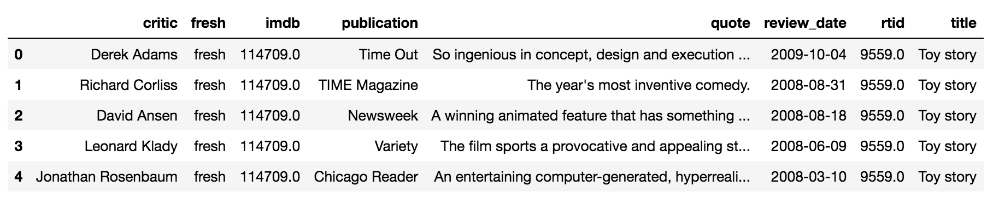
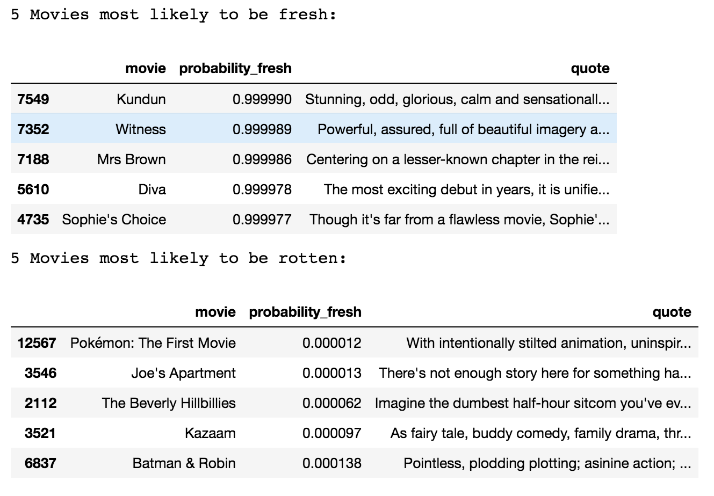

## Sentiment Analysis [[view code]](http://nbviewer.jupyter.org/github/marcotav/natural-language-processing/blob/master/sentiment-analysis/notebooks/sentiment-analysis.ipynb) 
     

The code is also available [here](http://nbviewer.jupyter.org/github/marcotav/natural-language-processing/blob/master/sentiment-analysis/notebooks/sentiment-analysis.ipynb)

<p align="center">
  <a href="#what"> What is Sentiment Analysis </a> •
  <a href="#goal"> Goal </a> •
  <a href="#imp"> Importing libraries and the data </a> •
  <a href="#count"> CountVectorizer </a> •
  <a href="#tts"> Training/test split and model </a> •
  <a href="#conc"> Conclusion </a> 
</p>

<a id = 'what'></a>
## What is Sentiment Analysis?

According to [Wikipedia](https://en.wikipedia.org/wiki/Sentiment_analysis):

> Sentiment analysis refers to the use of natural language processing, text analysis, computational linguistics, and biometrics to systematically identify, extract, quantify, and study affective states and subjective information. [...] Generally speaking, sentiment analysis aims to determine the attitude of a speaker, writer, or other subject with respect to some topic or the overall contextual polarity or emotional reaction to a document, interaction, or event. The attitude may be a judgment or evaluation (see appraisal theory), affective state (that is to say, the emotional state of the author or speaker), or the intended emotional communication (that is to say, the emotional effect intended by the author or interlocutor).

Another, more business oriented, [definition](https://www.paralleldots.com/sentiment-analysis) is:

> [The goal of sentiment analysis is to] understand the social sentiment of your brand, product or service while monitoring online conversations. Sentiment Analysis is contextual mining of text which identifies and extracts subjective information in source material.

<a id = 'goal'></a>
## Goal

In this project we will perform a kind of "reverse sentiment analysis" on a dataset consisting of movie review from [Rotten Tomatoes](https://www.rottentomatoes.com/). The dataset already contains the classification, which can be positive or negative, and the task at hand is to identify which words appear more frequently on reviews from each of the classes.

In this project, the [Naive Bayes algorithm](https://en.wikipedia.org/wiki/Naive_Bayes_classifier) will be used, more specifically the [Bernoulli Naive Bayes](https://en.wikipedia.org/wiki/Naive_Bayes_classifier#Bernoulli_naive_Bayes). From Wikipedia:

> In the multivariate Bernoulli event model, features are independent binary variables describing inputs.

Furthermore,

> If `x_i` is a boolean expressing the occurrence or absence of the i-th term from the vocabulary, then the likelihood of a document given a class `C_k` is given by:

<p align="center">
  
</p>  

where `p_{ki}` is the probability that a review k belonging to class `C_k` contains the term `x_i`. The classification is either 0 or 1 (negative or positive). In other words, the Bernoulli NB will tell us which words are more likely to appear *given that* the review is "fresh" versus or given that it is "rotten".

<a id = 'imp'></a>
## Importing libraries and the data

We need:
```
pandas 
numpy
```
and from `sklearn`:
```
from sklearn.naive_bayes import BernoulliNB
from sklearn.cross_validation import cross_val_score, train_test_split
```
The dataset is imported as usual:
```
rotten = pd.read_csv('rt_critics.csv')
```

A sample of the `rotten` is:

<p align="center">
  
</p> 


The columns `fresh` contains three classes, namely, "fresh", "rotten" and "none". The third one needs to be removed which can be done using the Python method `isin( )` which returns a boolean `DataFrame` showing whether each element in the `DataFrame` is contained in values.

```
rotten = rotten[rotten['fresh'].isin(['fresh','rotten'])]
```

We now turn the `fresh` column into 0s and 1s using `.map( )`.

```
rotten['fresh'] = rotten['fresh'].map(lambda x: 1 if x == 'fresh' else 0)
```
<a id = 'count'></a>
### CountVectorizer

We need number to run our model i.e. our predictor matrix of words must be numerical. For that we will use `CountVectorizer`. From the [sklearn documentation](http://scikit-learn.org/stable/modules/generated/sklearn.feature_extraction.text.CountVectorizer.html), `CountVectorizer`

> Converts a collection of text documents to a matrix of token counts. This implementation produces a sparse representation of the counts using scipy.sparse.csr_matrix.

We have to choose a range value `ngram_range`. The latter is:

> The lower and upper boundary of the range of n-values for different n-grams to be extracted. All values of n such that min_n <= n <= max_n will be used.

```
from sklearn.feature_extraction.text import CountVectorizer
ngram_range = (1,2)
max_features = 2000

cv = CountVectorizer(ngram_range=ngram_range, max_features=max_features, binary=True, stop_words='english')
```

The next step is to "learn the vocabulary dictionary and return term-document matrix" using `cv.fit_transform`. 

```
words = cv.fit_transform(rotten.quote)

The dataframe corresponding to this term-document matrix will be called `df_words`. This is our predictor matrix.
```

The method `todense()` returns a dense matrix representation of the matrix `words`.

```
df_words = pd.DataFrame(words.todense(), 
                        columns=cv.get_feature_names())
```
In this dataframe:
- Rows are classes
- Columns are features. 


<a id = 'tts'></a>
### Training/test split and model

We proceed as usual with a train/test split:

```
X_train, X_test, y_train, y_test = train_test_split(df_words.values, rotten.fresh.values, test_size=0.25)
```

We will now use `BernoulliNB()` on the training data to build a model to predict if the class is "fresh" or "rotten" based on the word appearances:

```
nb = BernoulliNB()
nb.fit(X_train, y_train)
```

We will now obtain the probability of words given the "fresh" classification. The log probabilities of a feature for given a class is obtained using `nb.feature_log_prob_`. We then exponentiate the result to get the actual probabilities. To organize our results we build a `DataFrame` which includes a new column showing the difference in probabilities:

```
feat_lp = nb.feature_log_prob_
fresh_p = np.exp(feat_lp[1])
rotten_p = np.exp(feat_lp[0])

df_new = pd.DataFrame({'fresh_probability':fresh_p, 
                       'rotten_probability':rotten_p, 
                       'feature':df_words.columns.values})

df_new['probability_diff'] = df_new['fresh_probability'] - df_new['rotten_probability']
```

Evaluating the model on the test set versus baseline

```
nb.score(X_test, y_test)
```


We now investigate which words are more likely to be found in "fresh" and "rotten" reviews

```
df_fresh = df_new.sort_values('probability_diff', ascending=False)
df_rotten = df_new.sort_values('probability_diff', ascending=True)
print('Words are more likely to be found in "fresh"')
df_fresh['feature'].tolist()[0:5]
print('Words are more likely to be found in "rotten"')
df_rotten['feature'].tolist()[0:5]
```
The output is:
```
Words are more likely to be found in "fresh"
['film', 'best', 'great', 'entertaining', 'performance']
Words are more likely to be found in "rotten"
['like', 'bad', 'really', 'movie']
```
<a id = 'conc'></a>
### Conclusion

We conclude by find which movies have highest probability of being "fresh" or "rotten"

We need to use the other columns of the original table for that. Defining the target and predictors, fitting the model to all data:

```
X = df_words.values
y = rotten['fresh']

model = BernoulliNB().fit(X,y)

df_full = pd.DataFrame({
        'probability_fresh':model.predict_proba(X)[:,1],
        'movie':rotten.title,
        'quote':rotten.quote
    })

df_fresh = df_full.sort_values('probability_fresh',ascending=False)
df_rotten = df_full.sort_values('probability_fresh',ascending=True)
```
Printing out the results:
```
print('5 Movies most likely to be fresh:')
df_fresh.head()
print('5 Movies most likely to be rotten:')
df_rotten.head()
```

<p align="center">
  
</p>
